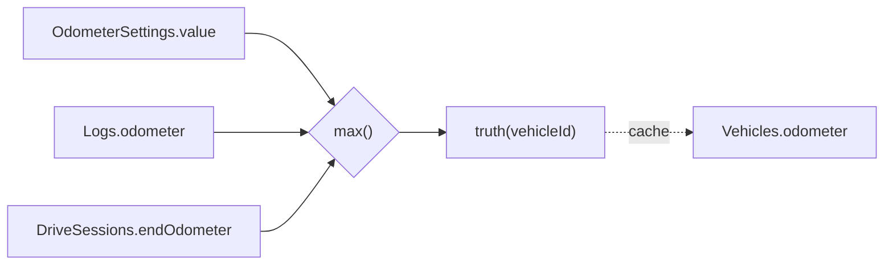

> 現状スナップショット ([screens](/carapp-landing/specs/snapshot/screens-current/) / [db](/carapp-landing/specs/snapshot/db-current/) / [data-flow](/carapp-landing/specs/snapshot/data-flow-current/) / [navigation](/carapp-landing/specs/snapshot/navigation-current/)) に対して、Issue #227-231 を適用した後の差分設計をまとめる。
>
> **対象 Issue**:
> - [#227 走行距離整合性 (OdometerSetting + 削除ロールバック)](https://github.com/CreativeCaffeine/carapp/issues/227)
> - [#228 走行距離下限バリデーション](https://github.com/CreativeCaffeine/carapp/issues/228)
> - [#229 ホームアイコン直接遷移](https://github.com/CreativeCaffeine/carapp/issues/229)
> - [#230 二重加算防止 確認 Popup](https://github.com/CreativeCaffeine/carapp/issues/230)
> - [#231 「愛車ログ」廃止](https://github.com/CreativeCaffeine/carapp/issues/231)
>
> **最終確認日**: 2026-06-06
> **ステータス**: 設計中

## Issue #227: 走行距離整合性 (OdometerSetting + 削除ロールバック)

### Before / After

| 項目 | Before (現状) | After (#227 適用後) |
|------|--------------|---------------------|
| テーブル定義 | `Vehicles.odometer` が唯一の現在 ODO | 新テーブル `OdometerSettings`、`Vehicles.odometer` はキャッシュ列 |
| odometer 書き込み箇所 | 5 箇所 (data-flow-current 参照) | **OdometerService** 経由 1 箇所に集約 + `Vehicles.odometer` の再計算 |
| 削除時挙動 | Log 削除しても `Vehicles.odometer` は更新されず巻き戻る | 削除のたびに `Vehicles.odometer` を `max()` で再計算 (ロールバック不要) |
| ホーム ODO 編集 | `Vehicles.odometer` 直接 UPDATE | `OdometerSettings.insert(source: manual)` |

### 新テーブル: OdometerSettings

```dart
class OdometerSettings extends Table {
  IntColumn get id => integer().autoIncrement()();
  IntColumn get vehicleId => integer().references(Vehicles, #id)();
  IntColumn get value => integer()();
  DateTimeColumn get recordedAt => dateTime()();
  TextColumn get source => text()(); // 'manual' | 'log' | 'drive' | 'init'
}
```

### 真実モデル



定式:

```
truth(vehicleId) =
  max(
    max(OdometerSettings.value where vehicleId = ?),
    max(Logs.odometer where vehicleId = ?),
    max(DriveSessions.endOdometer where vehicleId = ?)
  )
```

`Vehicles.odometer` は表示高速化のためのキャッシュ列とし、上記いずれかへの書き込み・削除時に必ず再計算して同期する。同期は `OdometerService.recompute(vehicleId)` (新規 `lib/services/odometer_service.dart`) に集約。

## Issue #228: 走行距離下限バリデーション

### 既存実装

`generic_record_form_screen.dart:1185` の `_confirmOdometerRegression()` が **給油フォームの新規作成時のみ** 起動する状態。他カテゴリ・他画面では同等のロジックが存在しない。

### 差分

- 共通ユーティリティ `lib/utils/odometer_validator.dart` に切り出し:
  ```dart
  class OdometerValidator {
    /// 現在の truth より小さい入力に対し、確認ダイアログを出すべきか判定。
    static bool shouldConfirmRegression({
      required int? entered,
      required int currentTruth,
    });

    /// 確認ダイアログ。共通の文言・閾値を集約。
    static Future<bool> confirmRegression(BuildContext ctx, {
      required int previous,
      required int entered,
    });
  }
  ```
- 適用画面: `generic_record_form_screen`, `drive_record_screen` (ドライブ手動追加), `vehicle_management_screen` (車両編集の ODO 直接編集), `home_screen` (`_OdometerChip._edit`)。
- 入力下限 = `truth(vehicleId)` (= Issue #227 の真実値)。

## Issue #229: ホームアイコン直接遷移

### Before

```
Home → 中央 + ボタン or アイコン → QuickAddMenu (modal) → カテゴリ選択 → サブカテゴリ選択 → generic_record_form
```

### After

```
Home → アイコン (給油/メンテ/洗車/書類/etc) → generic_record_form (直接)
                ↓ メンテだけは
                SubcategoryPopup (393×687) → generic_record_form
```

- **新規 widget**: `lib/widgets/subcategory_popup.dart` (393×687 のモーダル)
- メンテナンスのみサブカテゴリが 12 種類と多いため Popup を挟む。それ以外はホームのアイコンタップ → `categoryKey` を確定 → サブカテゴリ既定値 (例: 燃料 = 給油) で `generic_record_form` を直接 push。
- 中央 + ボタンの QuickAddMenu は **廃止候補** (確定はレビュー時)。
- ホーム実装 (`home_screen.dart`、現状 v2 反映済) に各アイコンの `onTap` ハンドラを追加し、`context.push('/log-new?category=fuel&subcategory=...')` 形式で遷移する想定。

## Issue #230: 二重加算防止 確認 Popup

### 現状の課題

`_confirmOdometerRegression()` は **小さい値** のみを警告対象とする。大きすぎる値 (例: 直近 10000 km → 入力 99999 km) の誤入力を防げない。

### 差分

- 既存 `_confirmOdometerRegression()` を Issue #228 の `OdometerValidator` 経由で **全 7 カテゴリ** の `_save` に適用。
- **閾値は category 別** (`lib/config/duplicate_thresholds.dart`):
  ```dart
  class DuplicateThresholds {
    static const fuelKm = 50;        // 給油: 直近 ±50km 以内は確認
    static const maintenanceKm = 100;
    static const cleaningKm = 30;
    // ...
  }
  ```
- 確認 Popup の文言は方向 (regression / unrealistic-forward) で分岐:
  - 「ODO が直近より小さい値です」(現状文言)
  - 「ODO が直近より大幅に大きい値です」(新規)
- ドライブ手動追加にも同じバリデーション適用。

## Issue #231: 「愛車ログ」廃止

### 差分

- `drive_memories_screen.dart` (`/memories`) を **廃止**。
- `logs_screen.dart` に DriveSession を統合表示。
- **二重解釈防止** のため `lib/models/unified_log_entry.dart` に sealed class:
  ```dart
  sealed class UnifiedLogEntry {
    DateTime get date;
    int? get vehicleId;
    int get cost; // DriveSession は 0
  }
  class LogEntry extends UnifiedLogEntry { final Log log; ... }
  class DriveEntry extends UnifiedLogEntry { final DriveSession session; ... }
  ```
- `logs_screen` は `Stream<List<UnifiedLogEntry>>` を購読、表示時に `switch` で分岐。
- 検索・フィルタ・統計集計はすべて `UnifiedLogEntry` を入力とする。
- **ShellRoute タブ 4 → 3 への検討**: 「ログ」タブに DriveSession が統合されると、「統計」「ホーム」とのバランスを再評価する。3 タブ化するかは Figma レビュー時に確定。

## 適用後の Critical Files まとめ

| ファイル | 役割 | 新規/既存 |
|---------|------|----------|
| `lib/database/tables.dart` | `OdometerSettings` テーブル追加 | 既存に追加 |
| `lib/services/odometer_service.dart` | OdometerSettings + truth() + Vehicles.odometer 再計算を集約 | **新規** |
| `lib/utils/odometer_validator.dart` | 共通バリデーション + 確認ダイアログ | **新規** |
| `lib/config/duplicate_thresholds.dart` | category 別閾値定数 | **新規** |
| `lib/widgets/subcategory_popup.dart` | メンテ用サブカテゴリ Popup (393×687) | **新規** |
| `lib/models/unified_log_entry.dart` | Log と DriveSession を統合する sealed class | **新規** |
| `lib/screens/home_screen.dart` | アイコン直接遷移ハンドラ追加、ODO 編集を OdometerService 経由に | 既存改修 |
| `lib/screens/generic_record_form_screen.dart` | `_confirmOdometerRegression` を OdometerValidator に置き換え、OdometerService 経由で記録 | 既存改修 |
| `lib/screens/vehicle_management_screen.dart` | odometer 書き込みを OdometerService 経由に | 既存改修 |
| `lib/screens/drive_record_screen.dart` | OdometerValidator 適用 | 既存改修 |
| `lib/providers/drive_provider.dart` | `_stopDriveLocked` の `Vehicles.odometer` 直接 UPDATE を OdometerService 経由に | 既存改修 |
| `lib/screens/logs_screen.dart` | UnifiedLogEntry 表示 | 既存改修 |
| `lib/screens/drive_memories_screen.dart` | **削除** | 既存削除 |
| `lib/main.dart` | `/memories` ルート削除、QuickAddMenu 関連削除 (Issue #229 確定時) | 既存改修 |
