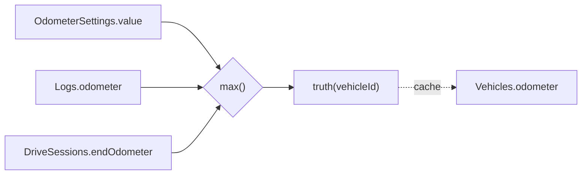

> 現状スナップショット ([screens](/carapp-landing/specs/snapshot/screens-current/) / [db](/carapp-landing/specs/snapshot/db-current/) / [data-flow](/carapp-landing/specs/snapshot/data-flow-current/) / [navigation](/carapp-landing/specs/snapshot/navigation-current/)) に対して、Issue #227-231 を適用した後の差分設計を **実装レベル** までまとめる。
>
> **対象 Issue (Wave 配置)**:
> - [#227 走行距離整合性 (OdometerSettings + 削除ロールバック)](https://github.com/CreativeCaffeine/carapp/issues/227) — **Wave 2 (土台)**
> - [#228 走行距離下限バリデーション](https://github.com/CreativeCaffeine/carapp/issues/228) — **#230 に統合のため close 予定**
> - [#229 ホームアイコン直接遷移](https://github.com/CreativeCaffeine/carapp/issues/229) — **Wave 4 (UI)**
> - [#230 二重加算防止 確認 Popup](https://github.com/CreativeCaffeine/carapp/issues/230) — **Wave 5 (保護層、#228 を吸収)**
> - [#231 「愛車ログ」廃止](https://github.com/CreativeCaffeine/carapp/issues/231) — **Wave 3 (UI)**
>
> **最終確認日**: 2026-06-06
> **ステータス**: 実装レベル設計、Plan 承認済み (Wave 2 着手前)
> **改訂履歴**: 初版 (概念レベル) → 本版 (実装レベル、2026-06-06)

## 設計の共通前提

| 項目 | 採用値 | 根拠 |
|---|---|---|
| 既存 widget の流用 | `showConfirmDialog()` (`lib/widgets/confirm_dialog.dart`) を #230 確認 Popup に流用 | 32×32 icon コンテナ・isDestructive 切替・accent 色がそのまま使える |
| Subcategory Popup | **QuickAddMenu とは独立の新規 widget** として作成 (`lib/widgets/subcategory_popup.dart`) | mose1021 確認済 |
| #228 vs #230 | **#228 を #230 に吸収** (エラーで弾かず常に確認 Popup) | mose1021 確認済 |
| カテゴリアイコン | 既存 `RecordCategory.icon` (LucideIcons) を流用 | record_categories.dart に全 7 カテゴリ定義済 |
| 走行距離訂正カテゴリ | **8 カテゴリ目** として `record_categories.dart` に追加。データは Logs ではなく `OdometerSettings` テーブルに保存 | ADR-003 真実モデルと整合 |
| Figma 未確定部分 | 「仮設計」として明示し、既存スタイル踏襲で実装。Figma 完成後に再調整 | mose1021 確認済 |

## Issue #227: 走行距離整合性 (OdometerSettings + 削除ロールバック)

> **Wave 2**。ADR-003 が定める「odometer 真実モデル」を実装する Wave。

### DB スキーマ追加

`lib/database/tables.dart`:

```dart
class OdometerSettings extends Table {
  IntColumn get id => integer().autoIncrement()();
  IntColumn get vehicleId => integer().references(Vehicles, #id)();
  IntColumn get value => integer()();           // km
  DateTimeColumn get recordedAt => dateTime()();
  TextColumn get source => text()();            // 'manual' | 'log' | 'drive' | 'init'
  TextColumn get memo => text().nullable()();   // ユーザーメモ (例: メーター交換)
}
```

### 新サービス

`lib/services/odometer_recalculation_service.dart`:

```dart
enum OdometerSettingSource { manual, log, drive, init }

class OdometerRecalculationService {
  /// truth(vehicleId) を計算し Vehicles.odometer に書き込む。
  Future<int> recompute(int vehicleId);

  /// OdometerSettings に 1 行追加し、続けて recompute() を呼ぶ。
  Future<void> recordSetting({
    required int vehicleId,
    required int value,
    required OdometerSettingSource source,
    DateTime? recordedAt,
    String? memo,
  });

  /// debug build assertion。Vehicles.odometer == truth() を確認。
  Future<void> assertConsistent(int vehicleId);
}
```

### recompute() のクエリ (Drift)

```dart
final maxSetting = await (select(odometerSettings)
  ..where((t) => t.vehicleId.equals(id))
  ..orderBy([(t) => OrderingTerm.desc(t.value)])
  ..limit(1)).getSingleOrNull();
final maxLog = await (select(logs)
  ..where((t) => t.vehicleId.equals(id) & t.odometer.isNotNull())
  ..orderBy([(t) => OrderingTerm.desc(t.odometer)])
  ..limit(1)).getSingleOrNull();
final maxDrive = await (select(driveSessions)
  ..where((t) => t.vehicleId.equals(id) & t.endOdometer.isNotNull())
  ..orderBy([(t) => OrderingTerm.desc(t.endOdometer)])
  ..limit(1)).getSingleOrNull();
final truth = [maxSetting?.value, maxLog?.odometer, maxDrive?.endOdometer]
    .whereType<int>()
    .fold<int>(0, math.max);
await (update(vehicles)..where((t) => t.id.equals(id)))
    .write(VehiclesCompanion(odometer: Value(truth)));
```

### マイグレーション

`lib/database/database.dart` の `migration`:

- `schemaVersion` を +1
- `onCreate` で `OdometerSettings` テーブル作成
- `onUpgrade` の新バージョン分岐で:

```sql
INSERT INTO odometer_settings (vehicle_id, value, recorded_at, source, memo)
SELECT id, odometer, COALESCE(created_at, datetime('now')), 'init', '既存データ初期化'
FROM vehicles
WHERE odometer > 0;
```

`odometer=0` の車両は Seed しない (Issue #227 受け入れ条件)。

### 削除ロールバック実装箇所

| ファイル | 修正 |
|---|---|
| `lib/screens/log_detail_screen.dart` (Log 削除) | 削除直後に `recompute(vehicleId)` |
| `lib/screens/drive_detail_screen.dart` (DriveSession 削除) | 同上 |
| `lib/services/vehicle_deletion_service.dart` | 車両ごと削除なので不要 (OdometerSettings も cascade) |

### 6 箇所の odometer 書き込みを `recordSetting()` 経由に置換

| # | ファイル:行 | 変換後 |
|---|---|---|
| 1 | `lib/screens/home_screen.dart:503` | `recordSetting(source: manual, memo: 'ホーム編集')` |
| 2 | `lib/screens/generic_record_form_screen.dart:724` | `recordSetting(source: log)` |
| 3 | `lib/screens/vehicle_management_screen.dart:848` | `recordSetting(source: manual, memo: '車両編集')` |
| 4 | `lib/providers/drive_provider.dart:716` | `recordSetting(source: drive)` |
| 5 | `lib/providers/onboarding_provider.dart:223` | `recordSetting(source: init)` |
| 6 | `lib/widgets/add_log_sheet.dart:59` | `recordSetting(source: log)` |

### feature flag

`useOdometerTruthModel` (default true)。Wave 2 完了 + 2 Wave 後に削除する。

### 真実モデル図



定式:

```
truth(vehicleId) =
  max(
    max(OdometerSettings.value where vehicleId = ?),
    max(Logs.odometer where vehicleId = ?),
    max(DriveSessions.endOdometer where vehicleId = ?)
  )
```

## Issue #228: 下限バリデーション → #230 に吸収

> **判断**: 単独 issue は **close** し、#230 確認 Popup の仕様に「閾値・ハードエラーは置かず、すべて Popup で確認」と明記する。

理由: 一定値以下でエラー弾きにすると「メーター交換で正当に巻き戻った」「過去の記録漏れを後から入力」のケースで詰む。常に Popup で巻き戻しを認識させる方が UX として一貫する。

GitHub Issue #228 は本 Plan 承認後に「`#230 に統合のため close`」コメント付きで close。

## Issue #229: ホームアイコン直接遷移 + Subcategory Popup

> **Wave 4**。Wave 3 (#231) と home_screen.dart で衝突しうるため、Wave 3 完了後に着手 (直列)。

### ホーム画面 `_RecordCard` の遷移先変更

`lib/screens/home_screen.dart`:

| アイコン | 現状遷移先 | 新遷移先 |
|---|---|---|
| 給油 (`fuel`) | 直接 form | 変更なし |
| 整備 (`wrench`) | QuickAddMenu | **`GenericRecordFormScreen(category: maintenance)` 直接 push + 初期表示で SubcategoryPopup 自動オープン** |
| 洗車 (`droplets`) | 直接 form | 変更なし |
| ドライブ (`carFront`/`navigation`) | QuickAddMenu | `DriveRecordScreen` (ドライブ手動追加 modal) 直接 |
| その他 (`circleEllipsis`) | QuickAddMenu | **QuickAddMenu のまま** (固定費・書類・その他・走行距離訂正 をまとめる窓口) |

### SubcategoryPopup widget の新規実装

`lib/widgets/subcategory_popup.dart` (Figma 393×687、新規作成):

```dart
class SubcategoryPopup extends ConsumerStatefulWidget {
  final RecordCategoryKey categoryKey;
  final void Function(SubcategoryDef selected) onSelected;
  const SubcategoryPopup({
    super.key,
    required this.categoryKey,
    required this.onSelected,
  });
}
```

- **構造**: `showModalBottomSheet` + `Container` (上角丸 24 = `AppRadius.lg`)
- **中身**:
  - タイトル「メンテナンス種別を選択」(category により可変)
  - `record_categories.dart` の `defaultSubcategories` を `ListTile` で縦並び
  - 各 `ListTile`: `SubcategoryDef.icon` + `name` + `chevron`
- **選択時**: `onSelected(selected)` 呼び、Popup close、`GenericRecordFormScreen` がそのサブカテゴリで初期化
- **キャンセル**: 戻るボタン + 背景タップ + スワイプダウン
- **初期表示**: `GenericRecordFormScreen.initState` で `WidgetsBinding.instance.addPostFrameCallback` から `showModalBottomSheet`

### Figma 仮設計マーク

- Figma に「Subcategory Popup」は 393×687 の枠だけある状態 (hijacke.boy ToDo 中)
- 中身のレイアウトは既存 `QuickAddMenu` の ListTile スタイルを踏襲した「仮設計」で実装
- Figma 完成後にスタイル調整

## Issue #230: 入力値が現在値より小さい場合の確認 Popup (#228 吸収版)

> **Wave 5**。Wave 2 (recordSetting 経由化) を前提とする。

### 実装箇所

`lib/screens/generic_record_form_screen.dart` の保存ボタンハンドラ。

既存 `_confirmOdometerRegression()` (`generic_record_form_screen.dart:1185`、現状は給油フォームのみ起動) を共通化して全カテゴリで呼ぶ:

```dart
Future<bool> _confirmOdometerRegression({
  required int inputValue,
  required int currentValue,
}) async {
  if (inputValue >= currentValue) return true; // そのまま保存
  return await showConfirmDialog(
    context,
    title: '走行距離が前回より小さい値です',
    message: '入力された走行距離 (${inputValue.toComma()} km) は\n'
             '現在の総走行距離 (${currentValue.toComma()} km) より小さい値です。\n\n'
             'このまま記録すると、総走行距離がこの値に巻き戻ります。\n'
             '記録自体は残り、削除すれば元の値に戻ります。',
    icon: LucideIcons.gauge,
    confirmLabel: 'このまま保存',
    cancelLabel: 'キャンセル',
    isDestructive: false,
  );
}
```

新規 widget (`lib/widgets/duplicate_record_guard.dart`) は **作らない**。既存 `showConfirmDialog` の流用で十分。

### 保存処理の流れ

```
1. ユーザーが保存ボタン押下
2. fields validate
3. odometer 入力あり? → _confirmOdometerRegression() → false ならフォームに戻る
4. db.transaction で Log INSERT
5. OdometerRecalculationService.recordSetting(source: log) を呼ぶ
6. recompute() で Vehicles.odometer を再計算
7. pop
```

### ドライブ中の振る舞い

`isDrivingProvider == true` のとき odometer 入力欄を read-only に + 「ドライブ中は終了時に自動加算されます」案内。これにより二重加算 (Issue #230 の根本) は構造的に発生しなくなる。

## Issue #231: 「愛車ログ」廃止 → DriveSession を logs_screen に統合

> **Wave 3**。#229 より先に実装する。

### ナビゲーション変更

- `drive_memories_screen` 廃止 → `/memories` ルート削除
- ShellRoute タブ構成は **変更なし** (4 タブのまま: ホーム / ログ / 統計 / 設定)
- ホーム画面の「愛車ログ」ショートカット (`_CarLogCard`) は削除し、最近の記録セクション (`_RecentRecordCard`) に DriveSession を混在

### logs_screen のタブ拡張

`lib/screens/logs_screen.dart` のフィルタタブを **5 個 → 10 個** に拡張 (mose1021 確定):

```dart
const tabs = [
  ('all', 'すべて'),
  ('fuel', '給油'),
  ('maintenance', '整備'),
  ('cleaning', '洗車'),
  ('trip_expense', 'ドライブ費用'),     // 旧「ドライブ」を改名
  ('drive_session', 'ドライブ記録'),    // 新規、DriveSession 専用
  ('insurance_tax', '固定費'),          // 新規
  ('document', '書類'),                 // 新規
  ('other', 'その他'),                  // 新規
  ('odometer_setting', '走行距離訂正'), // 新規 (#227 で追加するカテゴリ)
];
```

### 「ドライブ」という語の二義性に注意

| 旧名称 | 実体 | 新名称 |
|---|---|---|
| 「ドライブ」タブ | trip_expense Log (高速料金・駐車場代) | 「ドライブ費用」タブ |
| (なし、`/memories` に独立) | DriveSession (GPS 軌跡) | 「ドライブ記録」タブ |

コードコメントとタブラベル両方で「費用」「記録」を明示する。

### 統合 stream

`lib/models/unified_log_entry.dart` (新規) に sealed class:

```dart
sealed class UnifiedLogEntry {
  DateTime get date;
}
class UnifiedLog extends UnifiedLogEntry {
  final Log log;
  UnifiedLog(this.log);
  @override DateTime get date => log.date;
}
class UnifiedDriveSession extends UnifiedLogEntry {
  final DriveSession session;
  UnifiedDriveSession(this.session);
  @override DateTime get date => session.startTime;
}
```

`lib/providers/log_provider.dart` に `unifiedLogEntriesProvider` を追加:

```dart
final unifiedLogEntriesProvider =
    StreamProvider<List<UnifiedLogEntry>>((ref) async* {
  final vehicleId = ref.watch(activeVehicleProvider).value?.id;
  if (vehicleId == null) {
    yield [];
    return;
  }
  await for (final logs in db.watchLogs(vehicleId)) {
    final drives = await db.driveSessionsFor(vehicleId);
    final merged = <UnifiedLogEntry>[
      ...logs.map(UnifiedLog.new),
      ...drives.map(UnifiedDriveSession.new),
    ]..sort((a, b) => b.date.compareTo(a.date));
    yield merged;
  }
});
```

### filter 実装

| filter 値 | クエリ |
|---|---|
| `'all'` | そのまま全件 |
| `'drive_session'` | `entries.whereType<UnifiedDriveSession>()` |
| その他カテゴリ (例: `'fuel'`) | `entries.whereType<UnifiedLog>().where((e) => e.log.category == filter)` |

### 1 行 widget の Sealed class 分岐

| 型 | widget | 構造 |
|---|---|---|
| `UnifiedLog` | 既存 `_LogItem` を流用 (`logs_screen.dart:256-423`) | 変更なし |
| `UnifiedDriveSession` | 新規 `_DriveSessionItem` widget | 左: `LucideIcons.navigation` 円形アイコン (背景 `themeSoft`, accent `themeColor`) / 中央: タイトル (`session.title` ?? "ドライブ記録") + 日付 + 距離 (例: "12.3 km") / 右: スコア badge (S/A/B/C/D) / タップ → `/drive-detail/:sessionId` |

### ホーム最近の記録 `_RecentRecordCard`

`unifiedLogEntriesProvider.value.first` の型で分岐:

- `UnifiedLog` → 既存表示 (アイコン: カテゴリの `RecordCategory.icon`)
- `UnifiedDriveSession` → アイコン `LucideIcons.navigation` + "ドライブ記録 / 12.3 km" 表示
- タップ → 統合 `logs_screen` の「すべて」タブ

### ドライブ記録の作成導線

ホームの「ドライブ」アイコン (#229) からは引き続き `DriveRecordScreen` (手動追加) を開く。自動記録はドライブ開始フローのまま。

### Figma 仮設計マーク

Figma に「統合 logs_screen v2」「タブ拡張 (10 タブ)」「ドライブ行のデザイン」は未作成 (hijacke.boy ToDo 中):

- **本実装は仮設計**: 既存 `_LogItem` のスタイル踏襲、タブは横スクロール継続
- Figma 完成後に再調整 (10 タブの折りたたみ案・カードデザイン など)

### モバイル横スクロール幅のリスク

10 タブを横並びにするとモバイルでスクロール幅が長くなる。Figma v2 で「タブグループ折りたたみ」案も含めて hijacke.boy に確認する。

## 適用後の Critical Files まとめ

### 既存改修

| ファイル | 関連 Issue | 主な変更 |
|---|---|---|
| `lib/database/tables.dart` | #227 | `OdometerSettings` 追加 |
| `lib/database/database.dart` | #227 | migration / DAO / recalc 経路 |
| `lib/screens/home_screen.dart` | #229 / #231 | アイコン直接遷移、最近の記録 unified 化、愛車ログ削除 |
| `lib/screens/generic_record_form_screen.dart` | #230 | `_confirmOdometerRegression` 共通化、ドライブ中 read-only |
| `lib/screens/logs_screen.dart` | #231 | タブ 10 個に拡張、unified entry 表示 |
| `lib/screens/log_detail_screen.dart` | #227 | 削除時に `recompute()` 呼び出し |
| `lib/screens/drive_detail_screen.dart` | #227 | 同上 |
| `lib/providers/log_provider.dart` | #231 | `unifiedLogEntriesProvider` 追加 |
| `lib/providers/drive_provider.dart` | #227 | `recordSetting()` 経由化 |
| `lib/providers/onboarding_provider.dart` | #227 | 同上 |
| `lib/widgets/add_log_sheet.dart` | #227 | 同上 |
| `lib/models/record_categories.dart` | #227 | `odometer_setting` カテゴリ追加 |

### 新規

| ファイル | 関連 Issue | 内容 |
|---|---|---|
| `lib/services/odometer_recalculation_service.dart` | #227 | `recompute()` / `recordSetting()` / `assertConsistent()` |
| `lib/models/unified_log_entry.dart` | #231 | sealed class (UnifiedLog / UnifiedDriveSession) |
| `lib/widgets/subcategory_popup.dart` | #229 | Figma 393×687 |
| `test/services/odometer_recalculation_service_test.dart` | #227 | 単体テスト |
| `test/golden/subcategory_popup_test.dart` | #229 | golden test |

### 廃案 (旧 diff 設計にあったが今版で削除)

| ファイル | 理由 |
|---|---|
| `lib/utils/odometer_validator.dart` | #228 を #230 に吸収するため共通ヘルパは `generic_record_form_screen` 内に置く |
| `lib/widgets/duplicate_record_guard.dart` | 既存 `showConfirmDialog` を流用するため新規 widget 不要 |
| `lib/config/duplicate_thresholds.dart` | カテゴリ別閾値を設けない方針に変更 (#228 close) |
