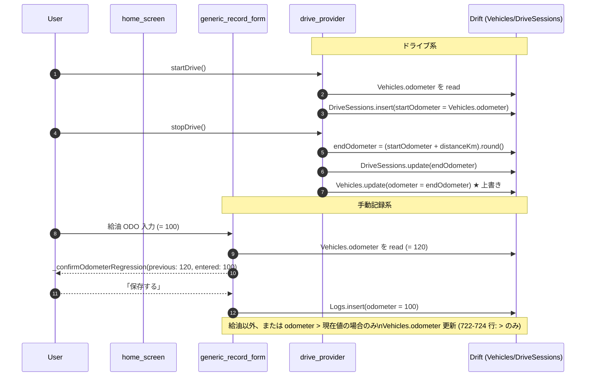

> 「ホーム表示の走行距離が記録のたびに上書きされて巻き戻る」「ドライブ終了で先に進んだ ODO が、その後の手動記録で巻き戻される」問題の根拠資料。
>
> **最終確認日**: 2026-06-06

## odometer 書き込み 5 箇所

`Vehicles.odometer` と `DriveSessions.startOdometer` / `endOdometer` を書き換える箇所を全列挙。行番号は 2026-06 時点 (`feat/figma-home-screen` ブランチ)。

| # | ファイル:行 | シンボル | 操作 | 対象列 |
|---|------------|---------|------|--------|
| 1 | `lib/screens/home_screen.dart:503` | `_OdometerChip._edit` | ホーム編集ダイアログから直接更新 | `Vehicles.odometer` |
| 2 | `lib/screens/generic_record_form_screen.dart:604-609 / 720-724` | `_save` (給油 ODO 逆行確認 → 後段の Vehicles 更新) | 記録保存時。`_confirmOdometerRegression()` で確認後、`odometer > activeVehicle.odometer` なら更新 | `Vehicles.odometer` |
| 3 | `lib/screens/vehicle_management_screen.dart:848` | `_save` | 車両編集画面で `odometer` を任意の値で上書き | `Vehicles.odometer` |
| 4 | `lib/providers/drive_provider.dart:624` | `startDrive` | ドライブ開始時に `Vehicles.odometer` をスナップショット | `DriveSessions.startOdometer` |
| 5 | `lib/providers/drive_provider.dart:708, 716` | `_stopDriveLocked` | `endOdometer = (startOdometer + distanceKm).round()` を計算し、Vehicles.odometer も同値で上書き | `DriveSessions.endOdometer` + `Vehicles.odometer` |

## odometer 書き込みフロー (sequenceDiagram)



## `_confirmOdometerRegression()` の現状実装

`lib/screens/generic_record_form_screen.dart:1185` に定義。**現状は給油フォーム (`_isFuelRefill`) かつ新規作成時のみ** で `_save()` 冒頭から呼び出される (604 行)。他カテゴリでは呼ばれない。

```dart
Future<bool?> _confirmOdometerRegression({
  required int previous,
  required int entered,
}) {
  // AlertDialog: "ODO が直近より小さい値です"
  //   入力された走行距離: {entered} km
  //   直近の走行距離:   {previous} km
  //   [キャンセル] [保存する]
}
```

**Issue #230** はこのダイアログを 7 カテゴリ全フォームに適用し、閾値も category 別に持たせる方針。

## Logs の単一情報源パターン (LogReader)

`Logs.memo` と `Logs.extraData` (JSON) は本来別フィールドだが、旧バージョンでは店舗名などを `memo` に保存していた経緯があり、表示側で両方読む必要がある。

`lib/utils/log_reader.dart` の静的メソッドが **唯一の参照点**:

| メソッド | 戻り値 | 役割 |
|---------|--------|------|
| `LogReader.memoOf(log)` | `String?` | ユーザ自由メモ |
| `LogReader.shopOf(log)` | `String?` | 店舗名 (旧 memo フォールバック含む) |
| `LogReader.locationOf(log)` | `String?` | 実施場所 |
| `LogReader.discountOf(log)` | `String?` | 割引額 |
| `LogReader.extraDataOf(log)` | `Map<String, dynamic>` | 表示用に正規化された extraData |

**読み手側の呼び出し箇所**: `log_detail_screen`, `log_detail_modal`, `tax/expense_report_detail_screen`, `services/export_service`。表示ロジック側で直接 `log.memo` / `log.extraData` を読まないのがルール (ADR-002 準拠)。

## 記録削除時の挙動 (Issue #227 の根拠)

現状、Log 削除は `db.delete(db.logs).where(...).go()` の **単純 DELETE** で、削除した Log の `odometer` 値による `Vehicles.odometer` ロールバックは行わない。

そのため、以下の不整合が発生する:

1. ODO=10000 で給油記録 A を作成 → `Vehicles.odometer = 10000`
2. ODO=10500 で給油記録 B を作成 → `Vehicles.odometer = 10500`
3. 記録 B を削除 → **`Vehicles.odometer` は 10500 のまま** (記録 A の 10000 に戻らない)
4. 次に ODO=10200 で記録すると `_confirmOdometerRegression()` が発火する

Issue #227 で `OdometerSettings` テーブルを導入し、真の ODO は記録の `max()` で算出する設計に切り替えることで、削除時のロールバック不要 (= 残った記録の max が真値) を実現する。

## DriveSession ↔ Log の関連

`Logs.driveSessionId` (nullable FK) は **ドライブ手動記録時のみ** セットされる (`drive_record_screen` 経由)。Drive 自動記録の場合は Log を作らず DriveSessions のみ存在する。

このため `logs_screen` は Log しか表示せず、`drive_memories_screen` (`/memories`) で DriveSessions を別画面表示するのが現状の二系統構造。Issue #231 で `UnifiedLogEntry` sealed class に統合する。
