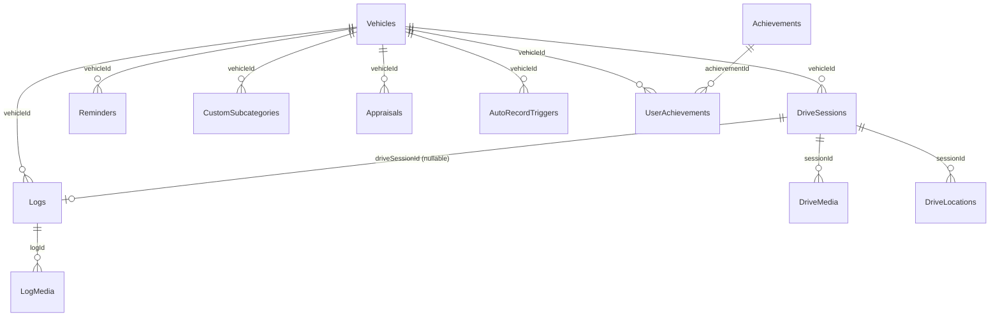

> `lib/database/tables.dart` 起点のスナップショット。DAO は `lib/database/database.dart` (`AppDatabase`) に集約。
>
> **odometer 列の分散** に注意。`Vehicles.odometer` (キャッシュ用ホット列)、`Logs.odometer` (nullable, 記録時点の手入力)、`DriveSessions.startOdometer` / `endOdometer` の **3 系統 4 列** に分散しており、Issue #227 で統合する。
>
> **最終確認日**: 2026-06-06

## Vehicles

| カラム | 型 | 備考 |
|--------|---|------|
| id | int PK | autoIncrement |
| name | text | 車両名 |
| plate | text? | ナンバープレート |
| **odometer** | int | デフォルト 0、**現在の総走行距離 (キャッシュ)** |
| isActive | bool | アクティブ車両判定 |
| type | text? | `car` / `kei` / `bike` |
| year | int? | 年式 |
| img | text? | 画像パス |
| createdAt | DateTime | currentDateAndTime |
| nextInspection | text? | 次回点検 |
| purchasePrice / marketValue | int? | 購入価格 / 査定相場 |
| currentTitle | text? | UserAchievements 由来 |
| maker / modelCode / firstRegistration | text? | 車検証情報 |
| weight / displacement | int? | 重量 (kg) / 排気量 (cc) |
| driveType | text? | FF/FR/4WD/MR |

**主要 DAO メソッド** (`AppDatabase`): `select(db.vehicles)`, `update(db.vehicles)`。
**触る画面**: `home_screen` (ODO 編集), `vehicle_management_screen`, `generic_record_form_screen`, `drive_provider`。

## Logs

| カラム | 型 | 備考 |
|--------|---|------|
| id | int PK | autoIncrement |
| vehicleId | int? → Vehicles.id | FK |
| date | DateTime | 記録日 |
| cost | int | 円、default 0 |
| **odometer** | int? | 記録時点の手入力 ODO |
| driveSessionId | int? → DriveSessions.id | ドライブ手動記録時のみ |
| memo | text? | 自由メモ。`LogReader.memoOf()` 経由で読む |
| category | text | `fuel` / `maintenance` / `insurance_tax` / `trip_expense` / `cleaning` / `document` / `other` |
| subcategory | text | 例: `給油` `タイヤ交換` `高速料金` |
| extraData | text? | JSON。サブカテゴリ固有フィールド |
| fuelLiters / fuelPricePerLiter / isFullTank | real? / real? / bool | 給油専用 |

**主要 DAO メソッド**: insert/update/delete via `db.logs`。`LogReader` (`lib/utils/log_reader.dart`) が `memo` / `extraData` の単一情報源パターンを提供。
**触る画面**: `generic_record_form_screen`, `log_detail_screen`, `logs_screen`, `cumulative_summary_screen`, `tax/*`。

## LogMedia

| カラム | 型 | 備考 |
|--------|---|------|
| id | int PK | |
| logId | int → Logs.id | FK |
| type | text | `photo` / `video` |
| url | text | ローカル相対パス |
| createdAt | DateTime | |

**触る画面**: `generic_record_form_screen`, `log_detail_screen`。

## DriveSessions

| カラム | 型 | 備考 |
|--------|---|------|
| id | int PK | |
| vehicleId | int? → Vehicles.id | FK |
| startTime / endTime | DateTime / DateTime? | endTime null = 進行中 |
| distance | real | km、終了時に丸める |
| **startOdometer** | int? | ドライブ開始時の Vehicles.odometer スナップショット |
| **endOdometer** | int? | `(startOdometer + distance).round()` |
| title / memo / weather / temperature | text?/text?/text?/real? | 思い出メタ |
| visibility | text | `public` / `unlisted` / `private` (default `private`) |
| score | int? | DriveScoringService |

**主要 DAO メソッド**: insert/update via `db.driveSessions`。
**触る画面**: `drive_provider`, `driving_screen`, `drive_result_screen`, `drive_detail_screen`, `drive_edit_screen`, `drive_memories_screen` (Issue #231 で廃止)。

## DriveMedia

| カラム | 型 | 備考 |
|--------|---|------|
| id | int PK | |
| sessionId | int → DriveSessions.id | FK |
| type / url / createdAt | text / text / DateTime | |

## DriveLocations

| カラム | 型 | 備考 |
|--------|---|------|
| id | int PK | |
| sessionId | int → DriveSessions.id | FK |
| timestamp | DateTime | |
| lat / lng | real | |
| speed | real? | m/s, nullable (後方互換) |

**触る画面**: `driving_screen`, `expanded_map_screen`, `drive_detail_screen`。

## Appraisals

| カラム | 型 | 備考 |
|--------|---|------|
| id | int PK | |
| vehicleId | int? → Vehicles.id | FK |
| date | DateTime | |
| value | int | 査定額 (円) |
| shopName | text? | |
| odometer | int? | 査定時 ODO |
| memo | text? | |

**触る画面**: `vehicle_management_screen` (相場推移)。

## CustomSubcategories

| カラム | 型 | 備考 |
|--------|---|------|
| id | int PK | |
| category | text | `fuel` / `maintenance` / `wash` / `other` |
| name | text | ユーザ定義のサブカテゴリ名 |
| vehicleId | int? → Vehicles.id | FK (null = 全車両共通) |
| createdAt | DateTime | |

**触る画面**: QuickAddMenu, `generic_record_form_screen`。

## Reminders

| カラム | 型 | 備考 |
|--------|---|------|
| id | int PK | |
| vehicleId | int | (FK 制約なし) |
| type | text | `oil` / `tire` / `battery` / `inspection` / `aircon` / `shaken` / `custom` |
| name | text | 表示名 |
| enabled | bool | |
| distanceTriggerKm | int? | null = 距離トリガなし |
| periodTriggerMonths | int? | null = 期間トリガなし |
| advanceDays | int | default 7 |
| lastServiceDate / lastServiceOdometer | DateTime? / int? | |
| nextDueDate / nextDueOdometer | DateTime? / int? | |
| memo | text? | |

**主要 Provider/Notifier**: `reminderNotifierProvider` (`updateAfterService`)。
**触る画面**: `reminders/*`, `settings/reminder_settings_screen`, `generic_record_form_screen` (記録保存後に次回予定更新)。

## AutoRecordTriggers

| カラム | 型 | 備考 |
|--------|---|------|
| id | int PK | |
| name | text? | ニックネーム |
| type | text | `ibeacon` / `bluetooth` |
| ibeaconUuid / ibeaconMajor / ibeaconMinor | text? / int? / int? | iBeacon 用 |
| bluetoothAddress / bluetoothName | text? / text? | Bluetooth 用 |
| cooldownMinutes | int | default 5 |
| vehicleId | int? → Vehicles.id | FK |
| createdAt | DateTime | |

**触る画面**: `settings/drive_record_settings_screen`。

## Achievements

| カラム | 型 | 備考 |
|--------|---|------|
| id / name / description / icon | int PK / text / text / text | マスタデータ |
| type | text | `distance` / `count` / `area` / `special` |
| threshold | real | 達成閾値 |
| rewardTitle | text? | 称号 |

## UserAchievements

| カラム | 型 | 備考 |
|--------|---|------|
| id | int PK | |
| achievementId | int → Achievements.id | FK |
| vehicleId | int? → Vehicles.id | FK |
| achievedAt | DateTime | |

**触る場所**: `AchievementService` (drive_provider・generic_record_form_screen から呼ばれる)。

## Titles

| カラム | 型 | 備考 |
|--------|---|------|
| id / name / category | int PK / text / text | category: `time` / `region` / `style` |

## ER 図 (主要 FK)

## odometer 列の分散 (重要)

| 場所 | 役割 | 整合性 |
|------|------|--------|
| `Vehicles.odometer` | 現在 ODO のキャッシュ。ホーム/結果画面の表示元 | 書き込み箇所 5 (data-flow-current 参照) |
| `Logs.odometer` (nullable) | 記録時点の手入力 ODO | Vehicles.odometer と独立して保存される |
| `DriveSessions.startOdometer` | ドライブ開始時の Vehicles.odometer スナップショット | startDrive 時に書き込み |
| `DriveSessions.endOdometer` | `(startOdometer + distance).round()` | stopDrive 時に Vehicles.odometer も同値で上書き |

Issue #227 で `OdometerSettings` テーブルを新設し、`Vehicles.odometer` をキャッシュ列化、真の ODO は `max(OdometerSettings.value, Logs.odometer, DriveSessions.endOdometer)` で算出する設計に移行する。詳細は [Issue #227-231 適用後の差分設計](/carapp-landing/specs/diff/after-issues-227-231/) を参照。
