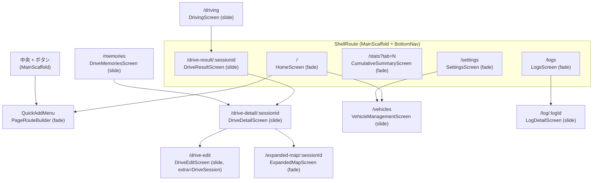

> `lib/main.dart` の `_router` (l.376-523) 起点。
> **タブ画面は ShellRoute + fade、それ以外は ShellRoute 外 + slide (CupertinoPage)** が `CLAUDE.md` のナビゲーション規則。
>
> **最終確認日**: 2026-06-06

## ルート構成 (flowchart)

## ルート一覧表

| パス | 画面 | 場所 | 遷移種類 | スワイプバック |
|------|------|------|---------|---------------|
| `/` | HomeScreen | ShellRoute 内 | `_fadePage` (FadeTransition) | なし |
| `/logs` | LogsScreen | ShellRoute 内 | `_fadePage` | なし |
| `/stats` | CumulativeSummaryScreen | ShellRoute 内 | `_fadePage` | なし |
| `/settings` | SettingsScreen | ShellRoute 内 | `_fadePage` | なし |
| `/drive-result/:sessionId` | DriveResultScreen | ShellRoute 内 | `_slidePage` (CupertinoPage) | **あり** |
| `/memories` | DriveMemoriesScreen | ShellRoute 外 | `_slidePage` | あり |
| `/drive-detail/:sessionId` | DriveDetailScreen | ShellRoute 外 | `_slidePage` | あり |
| `/drive-edit` | DriveEditScreen (extra: DriveSession) | ShellRoute 外 | `_slidePage` | あり |
| `/expanded-map/:sessionId` | ExpandedMapScreen | ShellRoute 外 | `_fadePage` | なし (FAB ライク) |
| `/driving` | DrivingScreen | ShellRoute 外 | `_slidePage` | あり |
| `/vehicles` | VehicleManagementScreen | ShellRoute 外 | `_slidePage` | あり |
| `/log/:logId` | LogDetailScreen | ShellRoute 外 | `_slidePage` | あり |

## 中央 + ボタンと QuickAddMenu

`MainScaffold._showQuickAddMenu()` (`lib/main.dart:585`) が `PageRouteBuilder<void>` を直接 `Navigator.push` し、`QuickAddMenu` をボトムシート風に被せる (Scrim + slide up は `QuickAddMenu` 内部で処理)。

- 遷移種類: PageRouteBuilder の `opaque: false` で背面が透ける。
- スワイプバック: なし (タップで Scrim を閉じる)。
- **Issue #229 で廃止候補**: ホームのアイコンタップから各 record form へ直接遷移する設計に変更予定。

## QuickAddMenu の 7 カテゴリ展開

`lib/widgets/quick_add_menu.dart` から `RecordCategories.all` (`lib/models/record_categories.dart`) を読み、以下に展開する:

| # | カテゴリ (key) | ラベル | ODO 入力 | 主なサブカテゴリ |
|---|---------------|--------|---------|----------------|
| 1 | `fuel` | 燃料 | あり | 給油 / 充電 |
| 2 | `maintenance` | メンテナンス | あり | 定期点検 / 車検 / 修理 / タイヤ交換 / オイル交換 / バッテリー交換 / 板金塗装 / 部品購入 / カスタム / タイヤローテ / ブレーキ / ワイパー |
| 3 | `cleaning` | クリーニング | あり | 洗車 / 車内清掃 |
| 4 | `tripExpense` (`trip_expense`) | ドライビング費用 | **なし** (`showOdometer: false`) | 高速料金 / 駐車場代 / 月極駐車場 |
| 5 | `insuranceTax` (`insurance_tax`) | 固定費 (月極・保険・税金) | **なし** | 自動車税 / 自賠責保険 / 任意保険 |
| 6 | `document` | 手続き・書類 | **なし** | 車検証 / 免許更新 / 名義変更 / 住所変更 / 廃車手続き / 届出 / リコール対応 |
| 7 | `other` | その他 | あり | カスタム / アクセサリー / 前金 / 装飾 / JAF・ロードサービス |

加えて **ドライブ手動追加** が QuickAddMenu の独立エントリとして存在し、`drive_record_screen.dart` を modal で push する。

## CLAUDE.md ナビゲーション規則 (再掲)

- **画面遷移のトランジションはスライド (右から) に統一**。`_slidePage()` (CupertinoPage) を使う。`_fadePage()` は原則タブ切り替え専用。
- タブ画面 (`/`, `/logs`, `/stats`, `/settings`) は ShellRoute 内で `_fadePage()`。
- それ以外の遷移先 (詳細・一覧・フォーム) は **ShellRoute の外** に GoRoute を定義し `_slidePage()` を使う。これにより CupertinoPage のネイティブ指追従スワイプバックが有効になる。
- `SwipeBackWrapper` は ShellRoute 内の画面にのみ使用する (ShellRoute 外なら不要)。
- **例外**: `/expanded-map/:sessionId` (拡大マップ) はタブ画面ではないが `_fadePage()` を採用している。地図 FAB 的な「同じセッションを別表示で覗き込む」UX を狙ったもの。CLAUDE.md の規則を厳密に読むと矛盾するため、規則を更新する際に「フェード使用ケース」を明示する候補。
